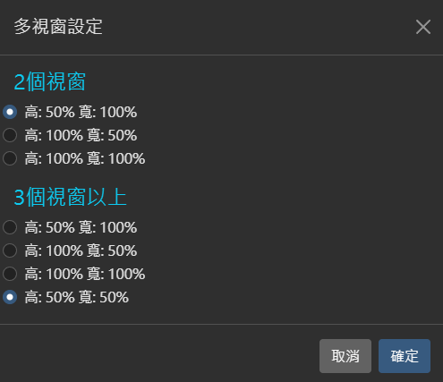
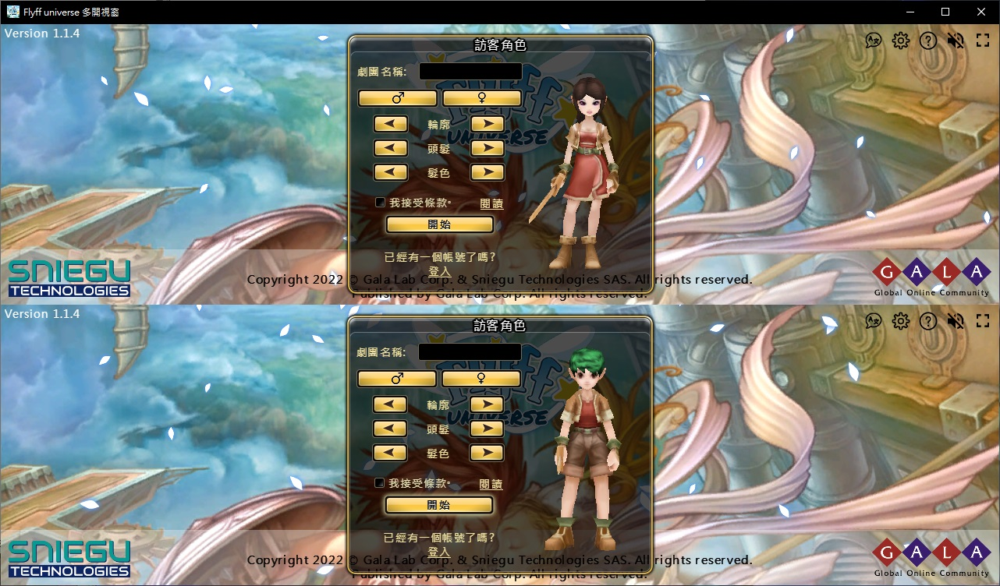
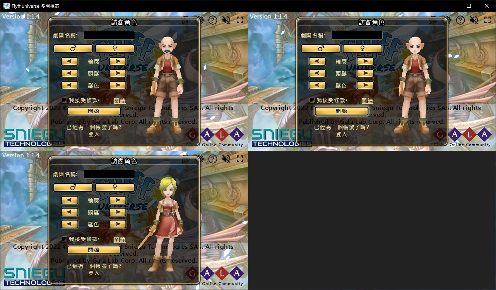
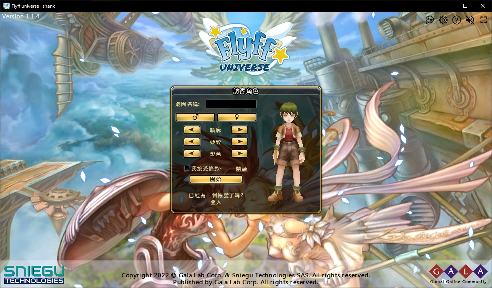

# flyff universe launcher
 flyff universe 启动器 (windows)

[Download](https://github.com/yungming/flyff-universe-launcher/releases)

- 单纯打开游戏，无外挂功能
- 每个设定档独立Cache&Session
- 有单视窗，同一个视窗多开
- F11 全萤幕
- 本应用程式基于Electron开发，跟Discord同一个Core
- 应用程式为学术研究
- 应用程式已用卡巴斯基扫毒，无病毒
- 多视窗设定自由摆放
- 觉得好用可以斗内↓

## ScreenShots
#### Main Window(主页面)

#### Multi Window(同一个视窗多开)

#### Single Window(单一视窗)

